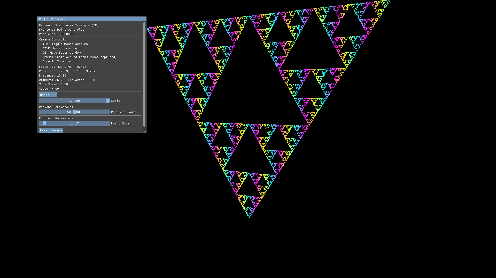

# Iterated Function Systems Visualizer

A high-performance **Vulkan-based fractal visualizer** for exploring Iterated Function Systems (IFS) with real-time GPU compute and interactive rendering.


*Sierpinski Triangle rendered with 50,000,000 particles*

---

## Features

- **GPU-Accelerated Compute** - Vulkan compute shaders for massively parallel IFS iteration
- **Real-time Rendering** - Up to 100,000,000 particles rendered at interactive framerates
- **MVC Architecture** - Clean separation between fractal computation (Backend), visualization (Frontend), and user interaction (Controller)
- **Dynamic Parameters** - Adjust particle count, iteration depth, and fractal parameters in real-time via ImGui
- **Extensible Design** - Plug-and-play backends (fractal types) and frontends (rendering styles)
- **Modern C++23** - Uses `std::expected`, concepts, and RAII patterns throughout

---

## Architecture

The project follows a **Model-View-Controller** pattern:

- **Model (Backend)**: `IFSBackend` - Computes fractal data using Vulkan compute shaders
  - `Sierpinski2D` - Classic Sierpinski Triangle fractal
  - Extensible to other IFS fractals (Barnsley Fern, Dragon Curve, etc.)

- **View (Frontend)**: `IFSFrontend` - Renders particle data
  - `ParticleRenderer` - Point-cloud visualization with depth testing
  - Extensible to other rendering modes (instanced meshes, volume rendering, etc.)

- **Controller**: `IFSController` - Manages window, input, camera, and UI
  - GLFW window management
  - 3D camera with mouse/keyboard controls
  - ImGui-based parameter UI
  - Synchronization between compute and graphics

---

## Building

### Prerequisites

- **CMake** 3.20+
- **Vulkan SDK** 1.3+
- **vcpkg** (automatically bootstrapped via CMake)
- **Slang Compiler** (for shader compilation)


### Manual Build

```sh
# Configure with CMake presets
cmake --preset dev-vcpkg      # Debug build with validation layers
cmake --preset release-vcpkg    # Optimized release build

# Build
cmake --build build

# Run
./build/playground/ifs_modular_main
```

---

## Usage

### Controls

- **Mouse Drag** - Rotate camera (hold left mouse button)
- **Scroll** - Zoom in/out
- **WASD** - Pan camera
- **TAB** - Toggle mouse capture
- **UI Sliders** - Adjust particle count (10K - 100M), iteration depth, etc.

### Adding New Fractals

1. Create a new backend class inheriting from `IFSBackend`
2. Implement `compute()` with your IFS algorithm
3. Expose parameters via `get_ui_callbacks()`
4. Register in main application

Example:
```cpp
class BarnsleyFern : public IFSBackend {
    void compute(vk::Buffer buffer, uint32_t count, const IFSParameters& params) override {
        // Implement Barnsley Fern IFS transformations
    }

    std::vector<UICallback> get_ui_callbacks() override {
        // Expose fern-specific parameters
    }
};
```

---

## Project Structure

```
IteratedFunctions/
├── include/ifs/              # Public headers
│   ├── IFSBackend.hpp        # Backend interface
│   ├── IFSFrontend.hpp       # Frontend interface
│   ├── IFSController.hpp     # Main controller
│   ├── backends/             # Fractal implementations
│   │   └── Sierpinski2D.hpp
│   └── frontends/            # Rendering implementations
│       └── ParticleRenderer.hpp
├── src/ifs/                  # Implementation files
├── shaders/                  # Slang compute/graphics shaders
│   └── ifs_modular/          # Sierpinski compute shader
├── playground/               # Example applications
│   └── ifs_modular_main.cpp  # Main visualizer app
└── test/                     # Unit tests
```

---

## Technical Details

### Vulkan Compute Pipeline

- **Compute Shader**: Iterates each particle through the IFS transformations in parallel
- **Storage Buffers**: Particle positions stored in GPU-visible buffers
- **Synchronization**: Compute → Graphics queue ownership transfer with semaphores
- **Descriptor Sets**: Dynamic binding for particle buffers, parameters

### Performance

- **50M particles** @ 30 FPS on NVIDIA RTX 4060
- **100M particles** @ 15 FPS on NVIDIA RTX 4060
- Logarithmic slider for intuitive particle count adjustment

### Shader System

- **Slang** shaders compiled to SPIR-V
- Automatic reflection for descriptor set layouts
- Hot-reloadable (planned feature)

---


## Acknowledgments

- **Vulkan** - High-performance graphics API
- **ImGui** - Immediate mode UI
- **GLFW** - Cross-platform windowing
- **GLM** - Mathematics library
- **spdlog** - Fast logging
- **Slang** - Shader compiler with reflection

---

## What I learned

I think it should probably create a template for Vulkan projects in general. Clean up does not play nice with the 
``std::expected`` controlflow when objects don't use RAII. I could alternatively have used ``vk::raii`` but the size overhead
in each object does not feel right. I think higher level abstractions should work without wasting too much space since 
lifetimes are often shared. 